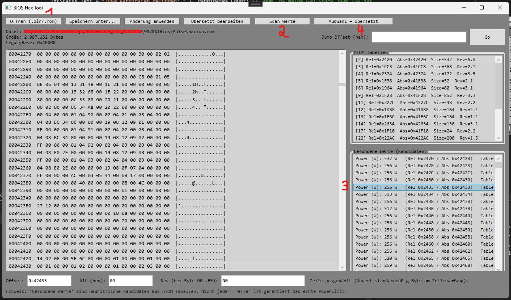
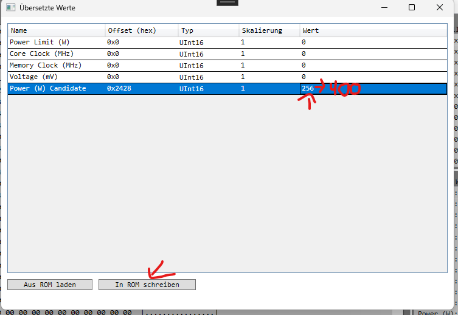

# BiosEditor (C# / WPF) – ROM Viewer & Editor

Privates WPF-Tool zum Laden, Analysieren und Speichern von GPU BIOS ROM-Dateien.
Ziel: Vertiefung von C#, WPF und Binary Parsing.

-> Ich habe keinen BIOS Editor gefunden, mit dem man aktuelle AMD vBIOS bearbeiten kann.. also habe ich angefangen mir selbst einen zu bauen.

## Features
- Laden und Anzeigen von .rom Dateien
- Strukturierte Darstellung technischer Tabellen/Offsets (AtomBIOS)
- Bearbeiten ausgewählter Werte und Speichern

## Tech-Stack
- C# (.NET)
- WPF
- Binary Parsing / Low-Level Datenverarbeitung

## Build & Run
- Projekt in Visual Studio öffnen
- Build (Debug)
- Starten

## Hinweis
Privates Lern- und Tool-Projekt. 

Das Projekt ist noch nicht vollständig abgeschlossen, nicht Final... bei benutzung aufpassen!!

Gerne auch Feedback da lassen :)

!!!Änderungen an BIOS/ROM-Dateien erfolgen auf eigenes Risiko!!!!.
